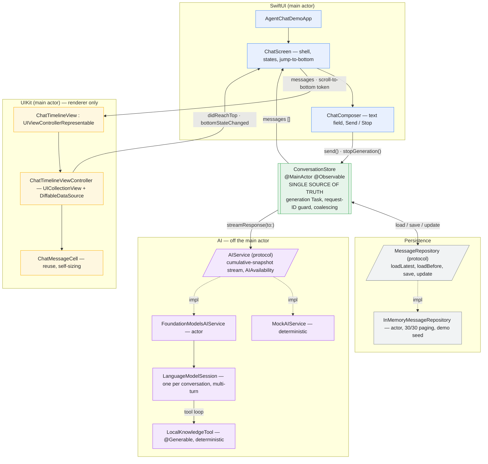

# AgentChatDemo

A production-style demo of a streaming, on-device AI chat for iOS 26, built to
show a Senior/Lead-level split between **SwiftUI**, **UIKit**, **Swift
Concurrency**, and **Foundation Models** — without ceremony. No third-party
dependencies.



<sub>Read it top-down: SwiftUI owns the shell and composer; UIKit renders the transcript and reports scroll events back; **`ConversationStore` is the only place business state lives**; it talks to persistence and to an `AIService` it never has to know is on-device, mock, or remote.</sub>

## Build & run

- Xcode 27 / iOS 26+ SDK, Swift 6 (`SWIFT_STRICT_CONCURRENCY = complete`).
- **iOS** — scheme **AgentChatDemo**, any iOS 26 Simulator or device.
- **Mac (Mac Catalyst)** — same scheme, pick **My Mac (Mac Catalyst)**, or
  `xcodebuild build -scheme AgentChatDemo -destination 'platform=macOS,variant=Mac Catalyst'`.
  The full UIKit `UICollectionView` timeline runs unchanged; the point is to
  step through `FoundationModelsAIService` / `LocalKnowledgeTool` against the
  real model with Xcode's debugger.
- Tests: `xcodebuild test -scheme AgentChatDemo -destination 'platform=iOS Simulator,name=iPhone 17'`
  (or `-destination 'platform=macOS,variant=Mac Catalyst'`).

The Simulator has no Apple Intelligence, so the app starts on **MockAIService**.
The debug menu (ladybug, top-right) switches to the real Foundation Model, seeds
1,000 messages, or clears the conversation. The real model needs **Apple
Intelligence enabled in System Settings**; otherwise the app shows the mapped
`AIAvailability` banner and stays on the mock — which is itself the
unavailable-state path this demo is meant to exercise.

> Running/debugging a Mac Catalyst (or "Designed for iPad") build **on this Mac**
> also requires the Xcode version to match the installed macOS build. With an
> Xcode beta on a newer macOS you may see *"Xcode doesn't support My Mac's
> macOS …"* on the run destination — the target still **compiles** for Catalyst;
> use a matching Xcode to launch it.

---

## Design notes

### 1. Why SwiftUI for the app shell
Navigation, the composer, empty/error/unavailable states, the "jump to bottom"
overlay, and dependency wiring are all declarative, low-frequency UI. SwiftUI is
the least-code option and gets state observation (`@Observable`) for free.

### 2. Why UICollectionView for the transcript
The transcript is the one part that is high-volume and *continuously mutating*
(a token stream rewriting the last row 20×/second, plus history paging in at the
top). `UICollectionViewDiffableDataSource` gives:

- explicit cell reuse and a predictable cell lifecycle (`prepareForReuse`),
- `reconfigureItems` to touch **one** cell during streaming,
- direct control of `contentOffset` for scroll anchoring on prepend,
- visible-cell-only rendering and a place to hang prefetching later.

### 3. Why not `LazyVStack`
`LazyVStack` inside a `ScrollView` re-evaluates and re-measures view identities
aggressively as content changes, has no first-class "reconfigure one row"
primitive, and gives you no reliable hook to preserve scroll position when
prepending. For a mostly-static list it would be fine; for this workload the
UICollectionView machinery is the point of the demo. It is deliberately *not*
used here.

### 4. Stable message identity
`ChatMessage.id` is a `UUID` assigned once at creation. It is the diffable data
source's item identifier. Cells are **never** identified by array index. While an
assistant message streams, its `content`/`status` mutate in place but its `id`
does not — so the data source does a `reconfigureItems([id])` on exactly that
row instead of a reload.

### 5. Streaming
`AIService.streamResponse(to:)` yields **cumulative full-text snapshots**
(`"H"`, `"He"`, `"Hello"`), not token deltas. `ConversationStore` *assigns* the
latest snapshot to the assistant message — never concatenates. Both
`MockAIService` and `FoundationModelsAIService` honour this contract, so the
store is identical for both.

Updates are coalesced: snapshots land in `pendingContent`, and a ~40 ms timer
flushes the latest one into `messages`, which drives a single
`reconfigureItems`. The model can emit far faster than 60 fps; the UI doesn't
try to keep up frame-for-frame.

### 6. Cancellation
`Stop` → `ConversationStore.stopGeneration()` → `generationTask.cancel()`. The
cancellation propagates structurally: the `for try await` loop over the stream
is in that task, so the `AsyncThrowingStream` terminates, its `onTermination`
fires, and `FoundationModelsAIService` stops iterating
`LanguageModelSession.streamResponse` (cancelling the model's own work). The
partial text already received is kept and the message becomes `.cancelled` — it
is not deleted.

### 7. Stale-stream protection
Every generation gets a fresh `requestID`, stored as `activeRequestID`. Before
any streamed snapshot, completion, or failure is applied, the code checks
`requestID == activeRequestID`. So the classic race —

```
Request A starts → user hits Stop → Request B starts → late output from A arrives
```

— cannot corrupt B: A's late output fails the check and is dropped. A superseded
request's task is also always cancelled first, so this is defence-in-depth.
Covered by `ConversationStoreTests.staleRequestCannotModifyNewer`.

### 8. Pagination & scroll preservation
Startup loads the latest 30. When the collection view scrolls within ~320 pt of
the top, `ChatTimelineViewController` calls back to
`ConversationStore.loadOlderMessages()`, which fetches the next 30 older via
`MessageRepository.loadBefore(messageID:limit:)`, de-dupes by `id`, and prepends.
`isLoadingOlderMessages` / `hasMoreHistory` prevent duplicate and past-the-end
requests.

To avoid a visible jump, the timeline **anchors** on the first visible item:
records its offset from the viewport top, applies the snapshot non-animated,
then restores `contentOffset` so that item is back where it was. (Self-sizing
cells make this sub-pixel-imperfect but visually stable.)

### 9. How Foundation Models is abstracted
`ConversationStore` depends only on the `AIService` protocol and the
`AIAvailability` enum. `FoundationModelsAIService` is the **only** file that
`import FoundationModels`. It:

- maps `SystemLanguageModel.default.availability` (`.available`,
  `.unavailable(.deviceNotEligible / .appleIntelligenceNotEnabled /
  .modelNotReady)`, unknown) onto `AIAvailability`, which the UI renders as a
  banner instead of crashing;
- keeps **one** `LanguageModelSession` per conversation for multi-turn context;
- is an `actor`, which structurally enforces "one active request at a time".

The UI transcript and the model's conversation context are separate concerns:
the repository may hold thousands of messages; the `LanguageModelSession` holds
the model's own context. We never replay the whole `messages` array into the
model.

### 10. Tool calling
`LocalKnowledgeTool` conforms to `FoundationModels.Tool` with a `@Generable`
`Arguments { query: String }`. It searches a small immutable fact list and
returns the top matches. It is attached to the `LanguageModelSession`, so:

```
user → LanguageModelSession → tool call → LocalKnowledgeTool → result → LanguageModelSession → final answer
```

The framework runs the tool loop; there is no hand-rolled agent loop.

### 11. What would change for a remote/server LLM
Write one more `AIService` conformer (`RemoteAIService`) that opens an SSE/socket
stream and re-emits **cumulative** snapshots (or accumulates deltas internally to
honour the contract). `ConversationStore`, the timeline, cancellation, and
stale-stream protection are unchanged. Tool calling would move server-side or be
brokered through the same protocol. Auth, retry/backoff, and offline queueing
would live in that conformer.

### 12. Production concerns intentionally omitted
- Real persistence — `InMemoryMessageRepository` only; the protocol is shaped so
  SwiftData/SQLite drops in without touching the store.
- Multiple conversations / a conversation list.
- Networking, auth, analytics, telemetry, crash reporting.
- Rich content (markdown rendering, images, code blocks), edit/delete/react.
- Prefetching, cell height caching, and Instruments-driven scroll tuning.
- Localization of user-facing strings, full VoiceOver rotor/actions pass.
- Token accounting / context-window UI (would use the Foundation Models API, not
  a hardcoded number).

---

## Project layout

```
AgentChatDemo/
├── App/
│   ├── AgentChatDemoApp.swift        SwiftUI @main
│   └── AppDependencies.swift         @Observable object graph + debug switches
├── Models/
│   ├── ChatMessage.swift             id / role / content / status / createdAt
│   ├── Conversation.swift
│   └── MessageStatus.swift           sending / streaming / completed / cancelled / failed
├── Features/Chat/
│   ├── ChatScreen.swift              composition root, availability banner, jump-to-bottom
│   ├── ChatComposer.swift            text field + Send/Stop
│   ├── ConversationStore.swift       @MainActor @Observable — source of truth
│   └── Timeline/
│       ├── ChatTimelineView.swift            UIViewControllerRepresentable bridge
│       ├── ChatTimelineViewController.swift  diffable data source, diffing, scroll rules
│       ├── ChatMessageCell.swift             pure-UIKit self-sizing bubble
│       └── ChatTimelineLayout.swift          compositional list layout
├── AI/
│   ├── AIService.swift               protocol + AIAvailability (no FoundationModels import)
│   ├── FoundationModelsAIService.swift   the only FoundationModels file (actor)
│   ├── MockAIService.swift           deterministic cumulative-snapshot stream
│   └── Tools/LocalKnowledgeTool.swift    @Generable Tool
└── Persistence/
    ├── MessageRepository.swift       loadLatest / loadBefore / save / update
    └── InMemoryMessageRepository.swift   actor; demo seeding lives here

AgentChatDemoTests/
├── ConversationStoreTests.swift      send / stream / cancel / stale / fail / paginate / retry
├── MockAIServiceTests.swift          cumulative snapshots + cancellation
└── Support/TestSupport.swift         ScriptedAIService, FailingAIService, waitUntil
```

## Concurrency model

| Type | Isolation | Why |
|---|---|---|
| `ConversationStore`, `AppDependencies` | `@MainActor` | UI-owned state |
| SwiftUI views, `ChatTimelineViewController` | `@MainActor` (via framework) | UIKit/SwiftUI |
| `AIService` / `MessageRepository` | `nonisolated` protocols | not UI-bound |
| `FoundationModelsAIService`, `InMemoryMessageRepository` | `actor` | own mutable state; serialize access |
| `MockAIService` | `nonisolated final class` | immutable config only |

Model work never runs on the main actor: the store's `for try await` loop is
`@MainActor` (cheap coordination), but the stream it consumes is produced inside
an actor / off-main `Task`. Repository writes are chained through one serial
`Task` so a `save` can't land after the `update` that supersedes it. No
`DispatchQueue`, no locks, no `@unchecked Sendable` in app code.
